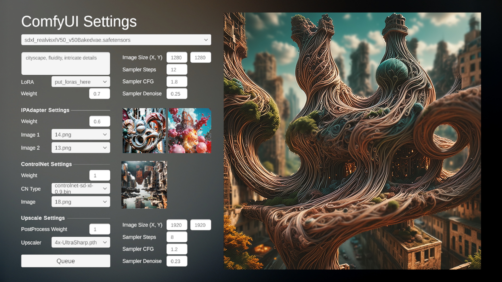

# ComfyUI-Unity

ComfyUI-Unity is an interface between **ComfyUI** and **Unity**, providing a seamless way to manage and interact with ComfyUI models directly within the Unity environment. It allows users to explore all models included in ComfyUI, select various processing options, and review generated results in real-time through an integrated Unity UI.

---

## 🖼️ UI Preview



---

## 🚀 Features

- **Integrated UI in Unity:** Access and manage ComfyUI models directly from the Unity interface.
- **Model Exploration:** Review all models included in ComfyUI, including:
  - **Checkpoint models**
  - **LoRAs (Low-Rank Adaptation)**
  - **IPAdapter**
  - **ControlNet**
  - **Upscaler models**
- **Flexible Configuration:**
  - Choose from **two samplers** for the generation process.
  - Select a **post-processing unit** for refining outputs.
- **Real-Time Results:** View the generated outputs directly in the Unity interface without needing to switch applications.

---

## 🖼️ UI Preview


---

## 🛠️ Installation and Setup

1. **Clone the Repository:**

   ```bash
   git clone https://github.com/yourusername/ComfyUI-Unity.git
   ```

2. **Download and Install Unity 6:**

   - Make sure you have Unity 6 installed on your system.

3. **Open the Project in Unity:**

   - Launch Unity and open the cloned project directory.

4. **Set Up ComfyUI:**

   - Ensure you have **ComfyUI** installed and properly configured.
   - Make sure that the **ComfyUI server runs on 127.0.0.1:8188**.

5. **Directory Structure:**

   - The project uses the **input** and **output** folders of ComfyUI for managing images.
   - Link the **input** and **output** folders correctly in your ComfyUI installation.

6. **Configure Network Settings:**

   - Ensure your local server is correctly running on:
     ```
     127.0.0.1:8188
     ```
   - This IP and port are hard-coded in the project, so make sure it matches your setup.

---

## 💡 Usage

1. **Launch the ComfyUI Server:**

   - Start ComfyUI and verify it is running on `127.0.0.1:8188`.

2. **Open the Unity Project:**

   - Launch Unity and load the **ComfyUI-Unity** project.

3. **Access the Interface:**

   - Open the **ComfyUI-Unity** interface from the Unity menu.

4. **Model Selection:**

   - Browse through available models:
     - Checkpoints
     - LoRAs
     - IPAdapter
     - ControlNet
     - Upscaler

5. **Configure Options:**

   - Choose **two samplers** and a **post-processing unit**.

6. **Generate Outputs:**

   - Start the generation process and view the results directly in the Unity interface.

---

## 📝 Requirements

- **Unity 6**
- **ComfyUI** installed and running on `127.0.0.1:8188`
- **Input and Output folders** linked correctly in the ComfyUI directory

---

## 📦 Dependencies

- Unity WebRTC Package (if applicable)
- Any other required Unity packages are specified in `Packages/manifest.json`.

---

## 🐛 Troubleshooting

- **Server Not Running:** Ensure that the **ComfyUI server** is active on `127.0.0.1:8188`. Run the server manually if needed.

- **No Image Output:** Check that the **input** and **output** folders are correctly linked to ComfyUI.

- **Unity Errors:** Make sure you are using **Unity 6**. Check for missing dependencies or broken references.

If you encounter any issues, feel free to open an issue on the [GitHub Issues](https://github.com/yourusername/ComfyUI-Unity/issues) page.

---

## 📧 Contact

For questions or support, please reach out via [GitHub Discussions](https://github.com/yourusername/ComfyUI-Unity/discussions) or open an issue.

---

## 📝 License

This project is licensed under the MIT License - see the [LICENSE](LICENSE) file for details.
